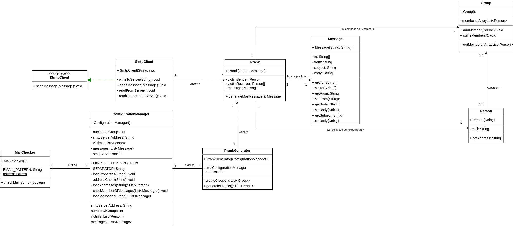

# Rapport laboratoire n°4 - SMTP

# Introduction
Ce rapport concerne le laboratoire n°4 qui a eu lieu pour le cours de DAI à l'HEIG-VD.

L'objectif de ce laboratoire était de pratiquer ce que l'on avait vu lors du cours SMTP.
Nous devions réaliser un client SMTP qui permettait d'envoyer des pranks à une liste de victimes.
L'utilisateur de l'application peut quant à lui définir la liste des victimes, ainsi que la liste des messages à envoyer.

Ce laboratoire était aussi accompagné d'une seconde partie qui nous initiait à Docker.
Pour tester que nos messages SMTP étaient corrects, nous avons mis en place un serveur MockMock qui imite un vrai serveur SMTP.
Ce serveur a été déployé en utilisant l'outil Docker.

# MockMock
## Description
MockMock fait partie de la catégorie des serveurs que l'on peut utiliser pour imiter un vrai service.
Dans notre cas, on l'utilise pour simuler un serveur SMTP. Cela nous évite de spammer un serveur SMTP qui est utilisé et duquel on pourrait se faire blacklist.
Le serveur MockMock que nous avons utilisé n'était pas la version initiale. C'est un clone d'un répertoire [GitHub](https://github.com/DominiqueComte/MockMock) qui subvenait mieux à nos besoins.

Grâce à celui-ci, on peut avoir un aperçu des diverses parties des mails que l'on envoie (headers, subject et body).

## Configuration
Pour la mise en place de notre serveur MockMock, nous avons utilisé l'outil Docker pour créer un container de serveur SMTP.

L'image docker que l'on a réalisée se trouve dans le fichier [Dockerfile](./docker/Dockerfile) que l'on peut retrouver dans le dossier [docker](./docker).
Dans ce dossier, on peut exécuter la commande ci-dessous pour construire l'image du container.

    ./build-image.sh

Une fois l'image prête, on peut l'exécuter avec le script ci-dessous.

    ./run-container.sh

On peut vérifier que le container s'exécute correctement grâce à la commande ci-dessous. On devrait retrouver le container qui est "running".

    docker ps -a

Pour accéder à la page web que propose MockMock, on peut se rendre à l'adresse [localhost:8080](localhost:8080).
Sur cette page, vous pourrez retrouver tous les e-mails reçus par le serveur et inspecter leurs détails.

# Client SMTP
## Configuration
Le client SMTP se configure en trois étapes :
- Propriétés techniques
- Liste de victimes
- Liste de messages
### Propriétés techniques
On peut retrouver ces quelques propriétés dans le fichier [config.properties](./MailRobot/config/config.properties), on peut y définir les informations du serveur et le nombre de groupes à créer.

Un groupe est au minimum composé de trois personnes (un expéditeur et deux destinataires). Lorsque l'on définit le nombre de groupes, il faut s'assurer qu'il y ait donc au minimum trois fois plus de personnes que de groupes.

    smtpServerAddress= <adresse IP du serveur ou localhost si en local>
    smtpServerPort= <port défini dans docker>
    numberOfGroups= <entre un et le nombre de victimes divisé par trois>

### Liste de victimes
On place les adresses mails des victimes dans le fichier [victims.utf8](./MailRobot/config/victims.utf8).
Nos adresses ont un format assez particulier "prenom.nom@domain.tld", si elles n'ont pas cette forme alors le programme ne fonctionne pas.
On rappelle qu'il doit y avoir trois fois plus de victimes que de groupes, sinon le programme ne s'exécute pas.

### Liste de messages
Un message est composé d'un sujet et d'un corps de message. Les différents messages sont séparés par le séparateur "---".
Il faut placer les messages dans [messages.utf8](./MailRobot/config/messages.utf8).
Ci-dessous la structure d'un message, on peut les copier les uns en dessous des autres.

    Subject: <Le sujet de votre message>
    <espace vide>
    <Le corps de votre message qui peut etre sur plusieurs lignes>
    ---
La dernière étape de la configuration est de compiler le programme. Il faut donc se rendre dans le dossier [MailRobot](./MailRobot/) et exécuter la commande maven ci-dessous.

    mvn clean package

## Utilisation

Maintenant que toutes les configurations ont été faites, il ne vous reste plus qu'à lancer le programme. Pour réaliser cette étape, il faut se rendre dans le dossier qui contient l'exécutable. C'est-à-dire le dossier [target](./MailRobot/target) et réaliser la commmande ci-dessous.

    java -jar mailrobot-1.0-SNAPSHOT.jar

Si vous utilisez MockMock, vous pouvez retrouver le nombre de mails qui correspond au nombre de groupes dans l'interface web.
Si vous passez par un vrai serveur SMTP, on espère que vos victimes tomberont dans le panneau.

## Implémentation

Pour pouvoir suivre la manière dont on a réalisé cette implémentation, vous pouvez vous aider du diagramme UML ci-dessous.

On peut séparer notre code en 4 parties :
- Partie SMTP : S'occupe de l'envoi des messages.
- Partie ConfigurationManager : Récupère les propriétés et vérifie les entrées.
- Partie métier : Elle modélise le message, ainsi que les groupes de victimes et les expéditeurs.
- Partie Prank : C'est la partie clé qui permet de tenir toutes les autres ensemble.

### Partie SMTP
Cette partie concerne l'envoi du mail lui-même.
C'est ici que l'on va récupérer les messages à envoyer (subject, body, destinataires et expéditeur) et que l'on va le traduire en requêtes SMTP pour les envoyer au serveur.

### Partie ConfigurationManager
Cette partie va traiter les 3 fichiers de configuration. Elle va lire et vérifier que les entrées dans les fichiers soient correctes.
C'est grâce à cette partie que l'on va créer toutes les personnes à piéger et tous les messages pour ensuite pouvoir les utiliser pour l'envoi des messages.

### Partie métier
La partie métier concerne tous les aspects de l'application qui sont spécifiquement reliés au contexte. Dans notre cas, on retrouve :
- La classe message : Elle modélise le mail à envoyer avec toutes ses caractéristiques, c'est-à-dire l'expéditeur, les destinataires, le sujet et le message.
- La classe personne : Permet de modéliser une personne avec son nom et prénom, mais surtout son adresse mail.
- La classe Groupe : C'est un groupe de Personne, cela nous permet notamment d'envoyer un mail à plusieurs personnes facilement.

### Partie Prank
C'est la partie qui va unir toutes les autres. Elle modélise le prank en lui-même en regroupant le message à envoyer et en lui ajoutant ses destinataires et son expéditeur.
C'est aussi via cette classe que le client SMTP va passer pour récupérer les informations qui composeront les requêtes SMTP.

## Exemple d'échange
Cette partie va schématiser l'échange entre un client (C) et un serveur (S) lors de l'envoi d'un mail.

    C: Connexion au serveur (socket)
    S: Accepte la connexion client
    C: EHLO <adresse serveur>
    S: 250-8BITMIME
    C: MAIL FROM <adresse expéditeur>
    S: 250 OK
    -- Répéter autant de fois qu'il y a de clients--
    C: RCPT TO <adresse d'un destinataire>           |
    S: 250 OK                                        |
    --------------------------------------------------
    C: DATA
    S: 250 OK
    S: 354 End data with <CR><LF>.<CR><LF>
    C: Sujet encodé en UTF-8
    C: Ligne vide + corps du mail
    C: '.' + ligne vide
    S: 250 OK
    C: QUIT
    S: 250 OK
    S: 221 <adresse serveur> closing connection
